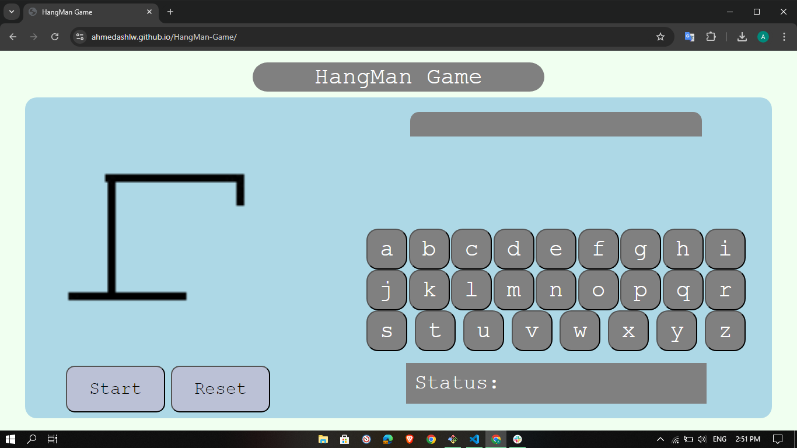
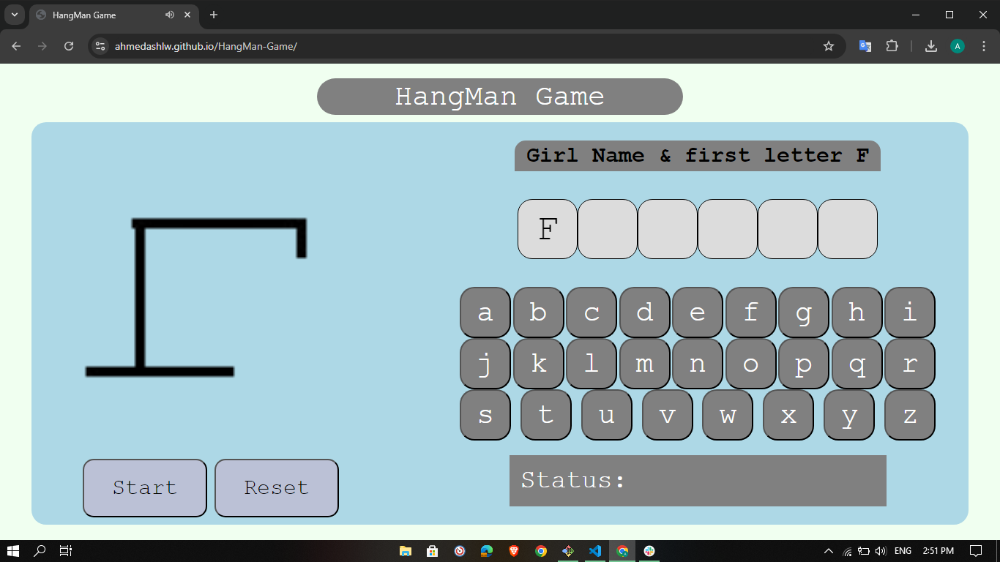
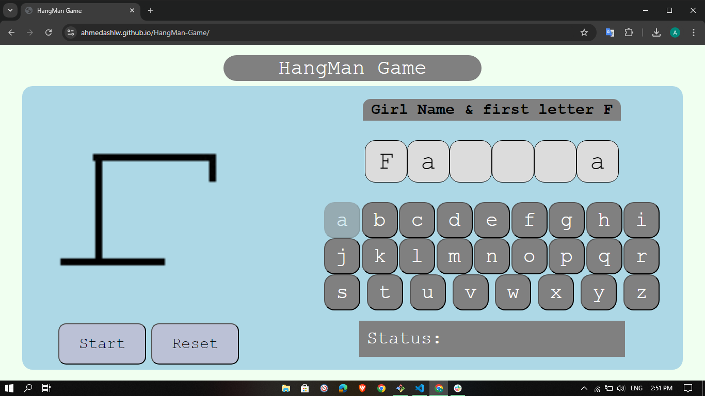
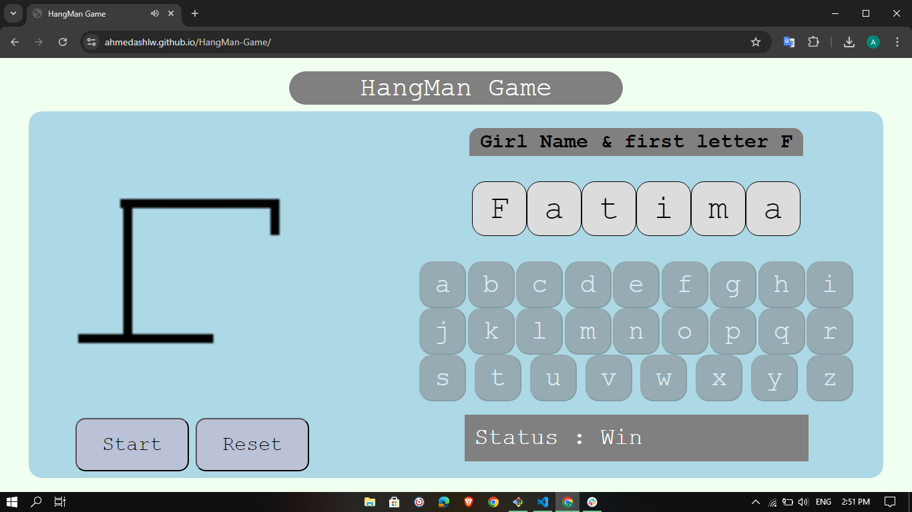
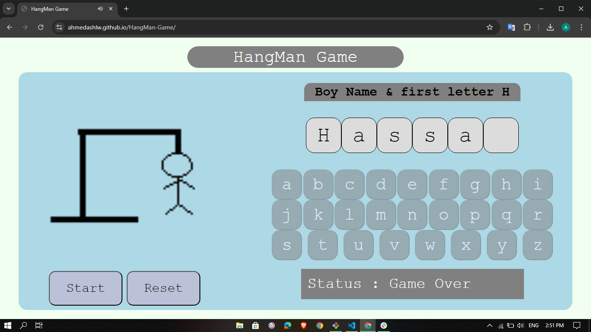

# HangMan Game

## Date: 9/7/2024

### By: Ahmed Darwish

#### [GitHub](https://github.com/AhmedAslw) | [LinkedIn](https://www.linkedin.com/in/ahmed-darwish-056b3a235/)

---

### Game Description

#### Hangman is a classic word guessing game. The objective is to guess the letters that make up a secret word before the entire hangman diagram is drawn.

---

### Technologies Used

- HTML
- CSS
- JAVASCRIPT

---

### User Story

1. The game should select a random word from a predefined word list.
2. The game should display the word as a series of underscores, one for each letter in the word.
3. The player should be able to guess letters by clicking on the letters of the alphabet provided.
4. If the player guesses a correct letter, the letter should be displayed in the correct position(s) within the word.
5. If the player guesses an incorrect letter, a part of the hangman diagram should be drawn.
6. The game should keep track of the number of incorrect guesses, and the game should end when the entire hangman diagram is complete (indicating a loss for the player).
7. If the player correctly guesses all the letters in the word before the hangman diagram is complete, the player should win the game.
8. The game should provide a clear indication of the player's win or loss at the end of the game.
9. The game should allow the player to start a new game after completing a round.

### Getting Started

```
1. The game selects a random word and displays it as a series of underscores, one for each letter.
2. The player clicks on letters from the alphabet to guess the word.
3. If the guessed letter is in the word, it is revealed in the correct position(s).
4. If the guessed letter is not in the word, a part of the hangman diagram is drawn.
5. The player continues guessing letters until they either:
- Correctly guess all the letters and win the game
- Run out of incorrect guesses and lose the game
6. After each game, the player can start a new game.
```

> ### Game Repository: [here](https://github.com/AhmedAshlw/HangMan-Game)

> ### Deployed Game: [here](https://AhmedAshlw.github.io/HangMan-Game/)

---

### **_Screenshots_**

#### Game before any action



#### After clicking start



#### Clicking letters and displaying them



#### Win in game



#### Game over and man Hanged



---

### Future Enhancements

1. Make the game responsive
2. Add counter of guesses
3. Do the status message as a pop card that gives the status

---
